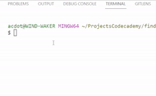

# Find Your Hat - Codecademy's Intro to Back-End Challenge Project

## How to Run the program

- Make a local clone using `git clone https://github.com/adamdoty/find-your-hat.git`
- Open the project in your file directory
- Run `node main.js`

There are 2 ways to adjust the size of the grid

1. At the top of `main.js`, manually adjust the variables: `fieldWidth`, `fieldHeight`, `percentageOfHoles`

2. Enter Grid Size and Percent of Holes as arguments in the node main.js command

   | command                | result                            |
   | ---------------------- | --------------------------------- |
   | `node main.js 5 20 20` |  |

## Project Prompt

Build an interactive terminal game. The scenario is that the player has lost their hat in a field full of holes, and they must navigate back to it without falling down one of the holes or stepping outside of the field.

## Guidelines

- Your project is centered on a Field class. This and the following tasks will describe how the class should function at a high level, and it will be up to you to figure out the implementation in code.
- Your game should be playable by users. In order to facilitate this, build out the following behavior:
  - When a user runs main.js, they should be prompted for input and be able to indicate which direction they’d like to “move”.
  - After entering an instruction, the user should see a printed result of their current field map with the tiles they have visited marked with `*`. They should be prompted for their next move.
  - This should continue until the user either:
    1. Wins by finding their hat.
    2. Loses by landing on (and falling in) a hole.
    3. Attempts to move “outside” the field.
  - When any of the above occur, let the user know and end the game.

## Reflection

### My Experience

- I was frustrated by the `Field` class containing all the game logic. This led me to restart the project twice.
- The first time I began to refactor the `player` out of the Field class, to its own class which doesn't really work. This is because the Field class is more like a Game Manager Class that contains all the logic for the game. The field is really a grid. I'm struggling to think of a concise way to refactor the class to conform to separation of concerns.
- The second time, I moved off platform to continue in VSCode. My code was messy so, I thought to myself, "I'll just start fresh and clean things up".
- I think it took me about 6 hours to get through the project because of the re-working and restarting. Going forward, I should be more cautious about restarting and be more concerned about just getting the code written first. Then I can refactor and clean things up.

### Extending the Project

- I'd like to investigate how to add graphics to the terminal to include sprites from a Game Asset Collection I use called [Minifantasy](https://krishna-palacio.itch.io/). The collection includes literal field sprites as well as a dungeon tileset that would go nicely with the project.
- A good addition to this project would be some tests using Mocha.
- To make the game seem more fair, add validation for the maze so unsolvable fields are not generated.
